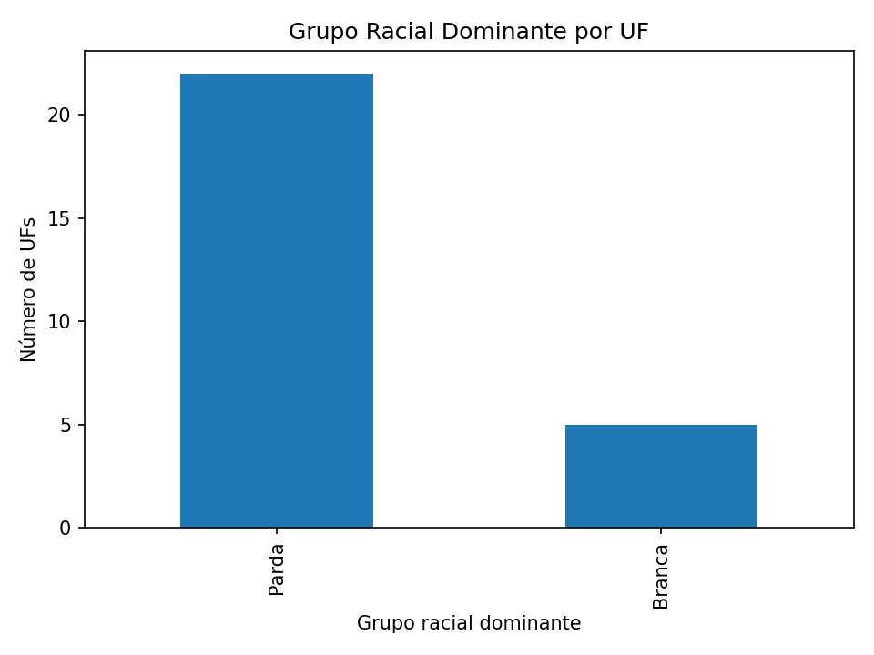
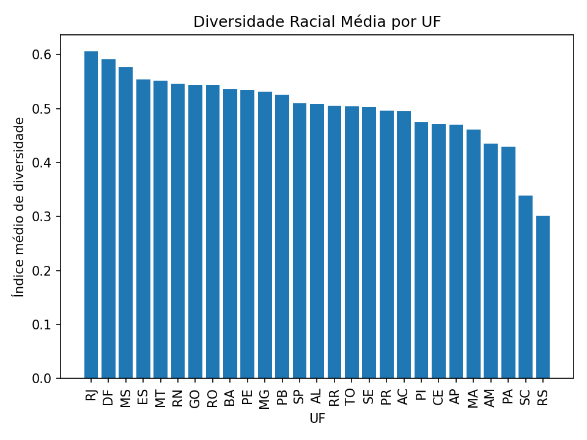
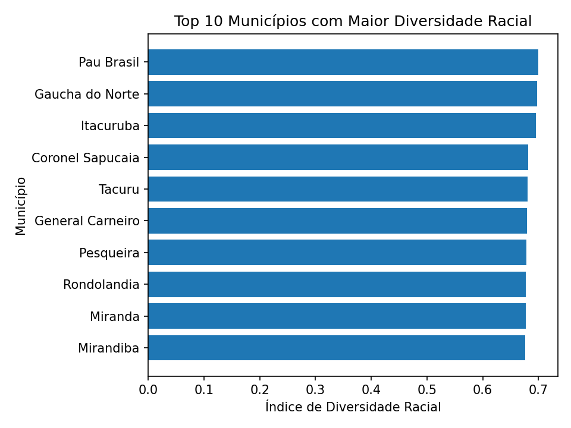
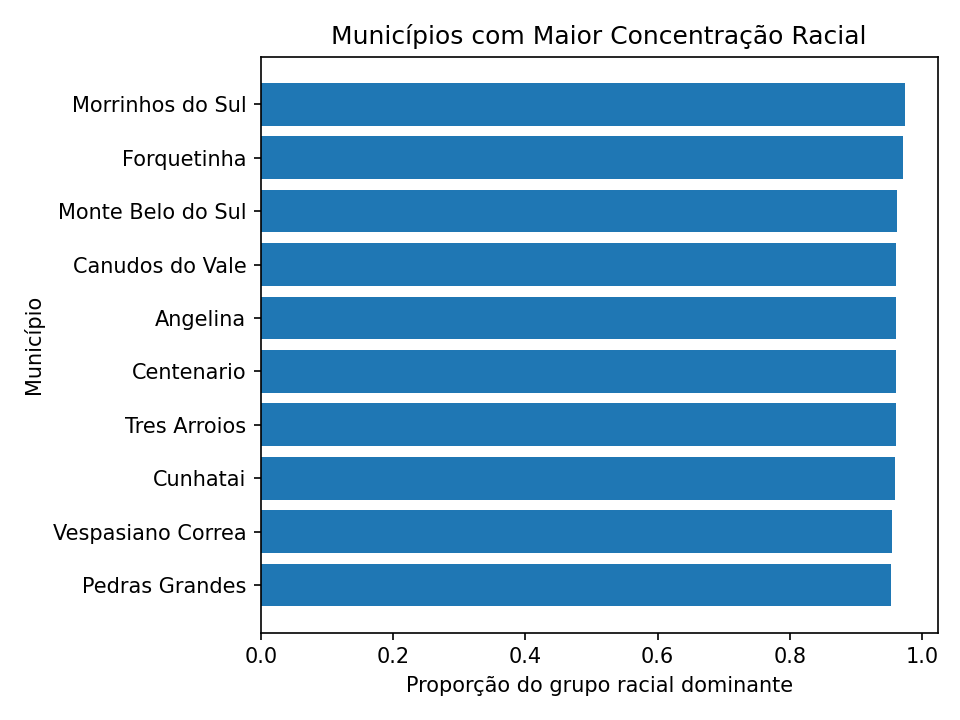

# Banco de Dados mun_data

Análise da **população residente por cor ou raça nos municípios brasileiros (Censo Demográfico 2022)**, a partir da **Tabela 9605 do IBGE (SIDRA)**.  

O projeto cobre todo o pipeline de dados: **importação → tratamento → modelagem relacional → validação → análises → visualizações**, com foco em boas práticas de **organização, reprodutibilidade e transparência metodológica**.

---

## 📌 Fonte dos dados

- **IBGE – SIDRA**
- **Tabela 9605** – População residente, por cor ou raça
- **Ano:** 2022 (atualização em 22/12/2023)
- **Unidade territorial:** Municípios (5.570)
- **Variáveis:**
  - Total
  - Branca
  - Preta
  - Amarela
  - Parda
  - Indígena

> Notas metodológicas importantes do IBGE (ex.: definição de população indígena, valores inibidos, ausentes ou zerados) foram consideradas durante a validação e análises.

---

## 🗂️ Estrutura do projeto

```text
mun_data/
│
├── data/
│   ├── raw/              # Dados originais do IBGE (sem alterações)
│   │   └── 9605.csv
│   └── curated/          # Dados tratados e normalizados
│       ├── 9605mun_info.csv
│       └── 9605mun_pop.csv
│
├── docs/
│   ├── dicionario_dados.md
│   └── metodologia.md
│
├── sql/
│   ├── schema/           # Criação e alteração do banco
│   ├── import/           # Importação dos CSVs
│   ├── validation/       # Checagens de consistência
│   ├── views/            # Views analíticas
│   └── analyses/         # Consultas analíticas finais
│
├── outputs/
│   ├── tables/           # Resultados em CSV
│   └── figures/          # Gráficos usados no README
│
├── scripts/
│   └── make_figures.py   # Geração automática dos gráficos
│
└── README.md
```
---

## 🧱 Modelagem de dados

O banco foi modelado de forma **normalizada**, separando **informações territoriais** e **dados populacionais**:

- **mun_info:** código IBGE, nome do município e UF
- **mun_pop:** totais populacionais por grupo racial

A relação entre as tabelas é feita via `muncod_ibge`.

---

## 🔎 Validação dos dados

Foram implementadas checagens de consistência, incluindo:

- Comparação entre `pop_total` e a soma dos grupos raciais
- Identificação de discrepâncias explicáveis pelas notas do IBGE
- Criação de **flag de alerta** para municípios com diferenças relevantes

As validações estão documentadas em:

```text
sql/validation/selects_validation.sql
```
---

## 📊 Análises realizadas

### 1️. Grupo racial dominante

- **Por município**
- **Por UF**

SQL:

```text
sql/analyses/grupo_racial_dominante_mun.sql
sql/analyses/grupo_racial_dominante_uf.sql
```

📈 Exemplo de visualização:



---

### 2️. Índice de diversidade racial

SQL:

```text
sql/analyses/diversidade_racial.sql
```
📈 Exemplo de visualização:





---

### 3. Concentração racial

SQL:

```text
sql/analyses/concentracao_racial.sql
```
📈 Exemplo de visualização:



---

## 🛠️ Tecnologias utilizadas

- **PostgreSQL** – modelagem, validação e análises
- **SQL** – consultas analíticas e views
- **Python (pandas + matplotlib)** – geração de gráficos
- **Git/GitHub** – versionamento e organização do projeto

---

## 📎 Documentação adicional

- **Dicionário de dados:** `docs/dicionario_dados.md`
- **Metodologia e notas do IBGE:** `docs/metodologia.md`

📌 *Projeto com fins educacionais, analíticos e de portfólio.*
